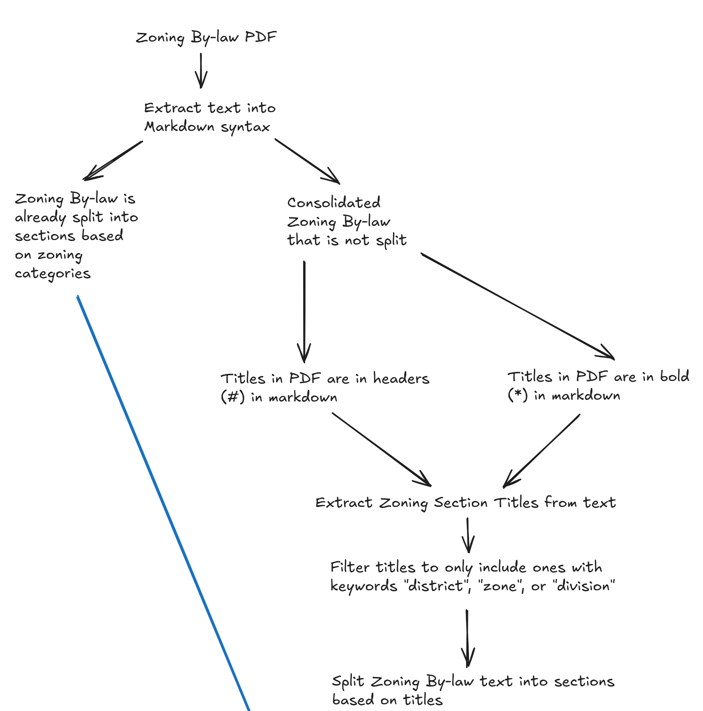

# Zoning PDF Text Extraction and Parsing Functions Documentation

These functions extract the text from the zoning by-law and parses it so that it can be used in other pipelines. Can also be used on its own to split up zoning by-law texts to make them easier to read and search for information.

## How it Works


The code opens a zoning by-law pdf document and uses the pymupdf4llm library to extract the text into markdown syntax. Markdown syntax is used because LLMs are better able to understand text and documents in markdown. Markdown provides heiarchy to text documents, which helps LLMs understand the pdf document structure.

As zoning by-laws from different municipalities vary greatly in formatting and complexity, a general pattern in formatting needs to be identified to design an algorithm that can successfully extract data from as many by-law formats as possible.

Extracting the section titles in the by-law documents is preferred because Table of Content formats vary too greatly across documents and make it difficult to extract the pdf sections. The text in the zoning by-laws have to be split into sections according to their zoning category because LLMs only accept a limited amount of tokens.

Once the text is extracted into markdown syntax, zoning categories and codes are extracted from the document section titles and stored in memory as a list/array. The list/array of extracted titles can be used to identify and extract the relevant sections of the text. The extracted sections are also stored in memory as a dictionary.

## Folder Structure
Required project/repository folder structure in order for the script to run.

When first working with this repository it's a good idea to empty all the text files in the three folders (llm-out, sections-out, and zoning-out) to start with a clean slate.
```
common_pdf_parsing
|   README.md
|   parsing.py
|   requirements.txt
|
|___llm-out
|___sections-out
|___zoning-out
```

## Dependancies
Refer to requirements.txt for all dependancies and versions
* PyMuPDF 1.25.2
* Python 3.13.0
* pymupdf4llm 0.0.17

## Getting Started
Console commands assume that you are using a powershell terminal on windows or VSCode.

Set up a Python virtual environment. "myenv" is the random name given to the virtual environment in this example. Change it to a name of your choice.
```
python -m venv myenv
```
Activate Python virtual environment
```
myenv/scripts/activate
```
Install dependancies
```
 pip install -r requirements.txt
 ```
or create requirements.txt file
```
pip freeze > requirements.txt
```
Run the code
```
python parsing.py
```
Deactivate virtual environment
```
deactivate
```