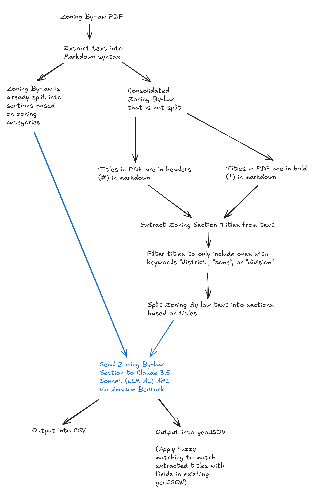
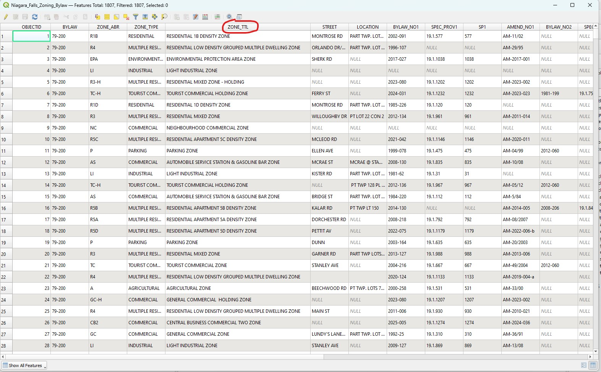
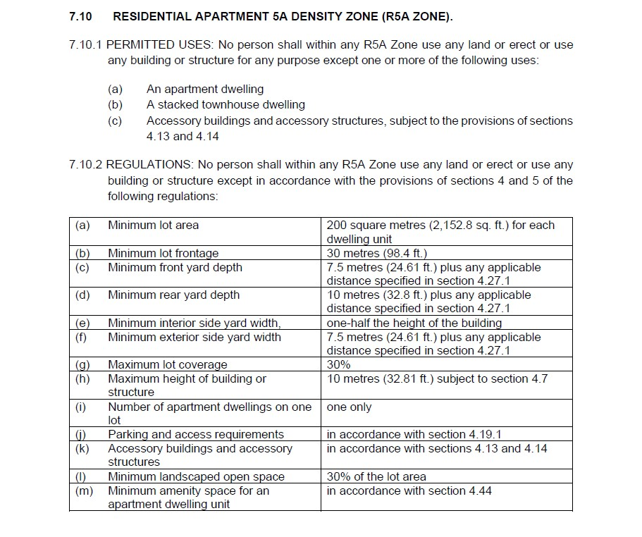
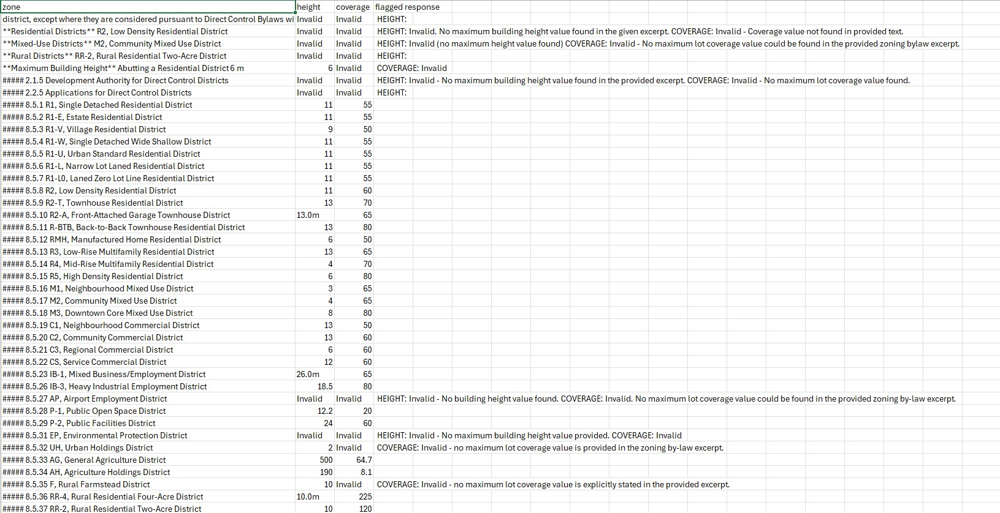
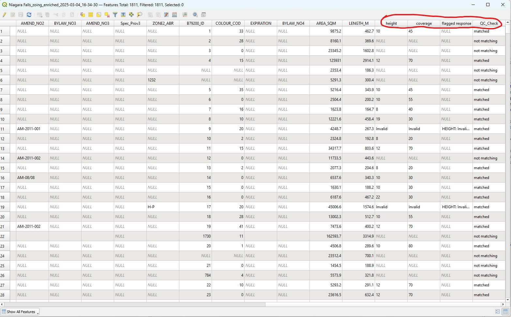

# Claude LLM API Pipeline Documentation

This pipeline was originally developed as part of a group project.

My role involved:
* Designing the overall pipeline architecture (PDF -> Markdown -> Text parsing -> LLM query -> LLM output to markdown text)
* Implementing the initial codebase and repository for the pipeline and setting up git for version control

Team contributions:
* LLM query and prompt refinement
* Extended the pipeline by building post processing scripts: Output to CSV tables and join with GeoJSON geospatial zoning data

This repository contains the version of the pipeline I maintain independently.

This pipeline explores extracting the zoning information by first extracting and parsing the text as markdown from the by-law PDFs, then sending a query to the LLM API with the extracted text. The LLM responds with the zoning information and the response is processed and exported into CSV format and joined with a zoning GeoJSON dataset.

### What are Zoning By-laws and why do they matter?
Zoning By-laws contain important information about land use, building height, density, and other development regulations. They are important documents that inform urban planning and development decisions in cities.

They are often stored as long, unstructured PDF legal documents and it's difficult to find information within them. Zoning information is also spatial and tied to geospatial datasets. It would be great if the zoning information in the by-laws could be extracted in an efficient and automated way and joined with geospatial datasets.

## How it Works


The first part of this code calls the [Zoning PDF Text Extraction and Parsing Functions](https://github.com/JoT8ng/zoning-extraction-pipelines/tree/main/common_pdf_parsing) which handles PDF text extraction and parsing. Refer to the documentation and Jupyter Notebook for further explanation of how the function works.

To improve accuracy, the script requires an existing zoning geoJSON spatial dataset from the jurisdiction the zoning by-law is from. The script requires the user to declare the fieldname in the geoJSON that has all the zoning category titles. While calling the different parsing functions to parse the zoning PDF for zoning category titles and split it into sections, the script checks if the zoning categories extracted match the categories in the geoJSON using fuzzy matching.

The title/zoning category and its section text (contained in a python dictionary), extracted by the [Zoning PDF Text Extraction and Parsing Funcions](https://github.com/JoT8ng/zoning-extraction-pipelines/tree/main/common_pdf_parsing), is placed into a prompt that is used to make a query to the LLM (Claude 3.5 Sonnet api via Amazon Bedrock). The dictionary containing all the extracted and parsed infor is only sent to the LLM API if it has a match with the titles in the geoJSON.

The LLM's output is stored in memory into another python dictionary and also output as text files in markdown syntax for users to view. The output is then processed and joined with geospatial geoJSON zoning datasets and output as a CSV.

This pipeline requires the user to review all the LLM outputs in the CSV and geoJSON, in case the response contains hallucinations. To facilitate this review process, the LLM prompts are very specific. If the LLM cannot find the relevant zoning information (maximum building height or lot coverage etc.) it will respond with "invalid" and a reason for why it cannot find the information. This flags certain rows of data for the user to check.

## Example Inputs and Outputs

Example geoJSON attribute table with zoning category field name.



Example zoning by-law text



Example CSV output



Example geoJSON output



## Why was Anthropic Claude used?
Anthropic Claude was the generative LLM model chosen based on project requirements and organizational constraints at the time.

## Closing Thoughts

This pipeline offers a powerful and efficient way to streamline zoning data extraction workflows, enabling users to process large, complex by-law PDFs and quickly surface relevant zoning details. By combining PDF parsing, fuzzy matching against authoritative geoJSON datasets, and targeted LLM queries, it reduces the manual effort required to locate and structure zoning information.

However, all text generating and question answering LLMs, like Anthropic Claude, have a tendency to hallucinate and misinterpret text.  While the pipeline incorporates safeguards—like strict prompt design, “invalid” flags for missing data, and integration with known zoning categories—outputs cannot be guaranteed to be 100% accurate. All outputs must be validated by the user, reviewing flagged rows and cross-checking extracted values against authoritative sources, to ensure the final dataset can be used for reliable decision making.

**Possible Next Steps**:

* Fine-tune a lightweight pre-trained NER model for zoning-specific entity extraction
* Conduct zero-shot NER classification experiments, testing and comparing different LLM models
* If possible, implement automated rule based validation to reduce manual review effort of output datasets

## Folder Structure
Required project/repository folder structure in order for the script to run.

This pipeline script requires users to have an existing zoning by-law PDF and zoning geospatial geoJSON dataset to run.
```
llm_api_pipeline
|   README.md
|   requirements.txt
|   |___ src/
    |    |___ bylawextract.py
    |    |___ llmapi.py
    |    |___ parsing.py
    |    |___ example_zoningbylaw_text.pdf
    |    |___ example_zoning.geojson
```

## Dependancies
Refer to requirements.txt for all dependancies and versions
* PyMuPDF 1.25.2
* Python 3.13.0
* pymupdf4llm 0.0.17
* AWS bedrock Claude 3.5 Sonnet v2

## Getting Started
Console commands assume that you are using a powershell terminal on windows or VSCode.

Set up a Python virtual environment. "myenv" is the random name given to the virtual environment in this example. Change it to a name of your choice.
```
python -m venv myenv
```
Activate Python virtual environment
```
myenv/scripts/activate
```
Install dependancies
```
 pip install -r requirements.txt
 ```
or create requirements.txt file
```
pip freeze > requirements.txt
```
Run the code at the root repository
```
python bylawextract.py
```
Deactivate virtual environment
```
deactivate
```